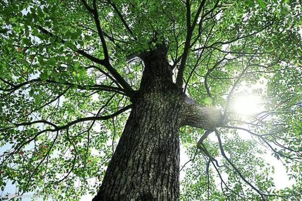

# 又听《亲情树》主题曲

<!--  -->

又听到电视剧《亲情树》主题曲，永不结束。

伴随着音乐声，儿时的记忆就像涓涓流水一样，婉转绵长，涌进心田。

一代人有一代人的记忆，歌曲的评论寥寥无几，可能大多数人已经遗忘了那个岁月吧。

我是遗憾的，因为那样的岁月已经一去不复返了，

我也是庆幸的，因为内心依然为那份宁静保留着空间，让我的心变得柔软。

是啊，大多人的生活是平凡的，在平凡的生活中才能找到生活的本质

历史往往记录的是金戈铁马，缺少的却是袅袅炊烟。

